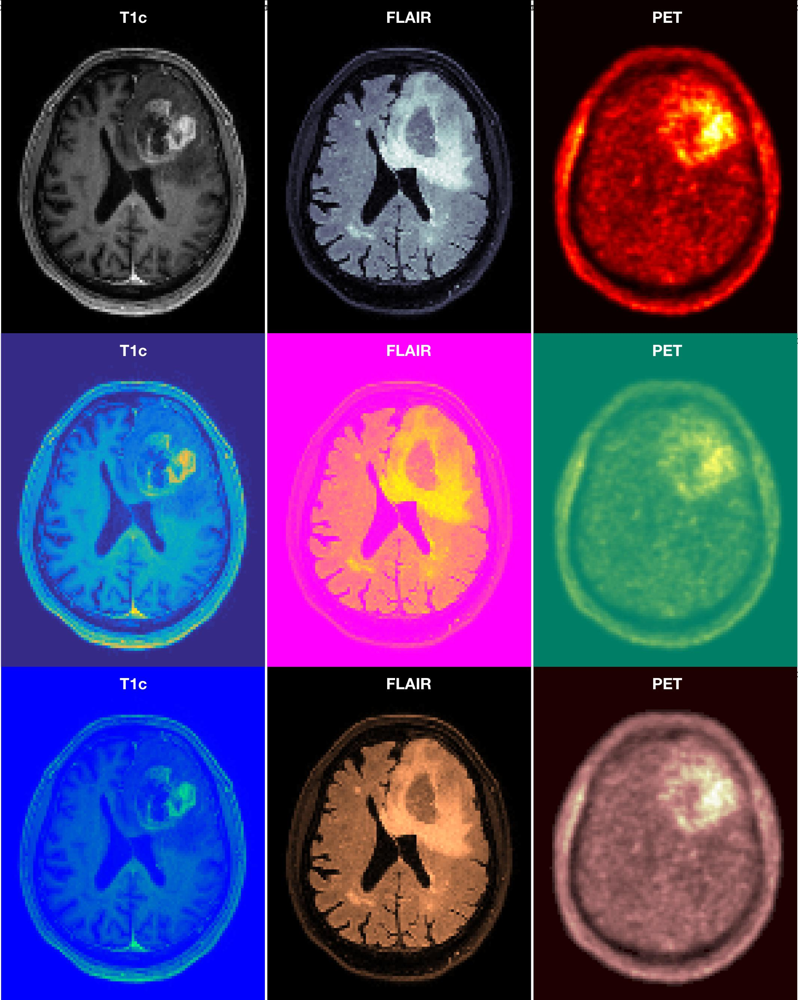

# Visualise Multiple Medical (nifty) Scans
 * Provides a quick overview of multimodal nifty scans
 * Read in a list of nifty scans
 * Visualise them all in one figure on given z-slice 

# Example
 * Folder testdata contains 3 nifty volumes
 * Script in src/example visualise them all in one combined image
 * In the example the three test scans are repeated to mimic visualisation of multiple (here 9) scans
 * Composition of all nine scans is shown on the figure below

:panda_face: 
